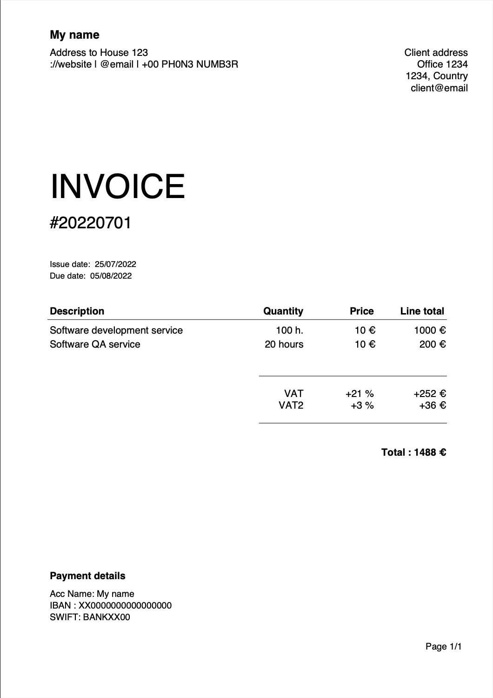

# invoice

A simple way to generate invoices

## Result file example



## How to use

There are two ways of using the invoice tool:

1. Using a binary file. So you don't need to deal with any code.
2. Running the `main.go` file. Which needs some previous setup.

### 1. Using the binary file

#### Download

Depending on the operating system you are on, you can download and use the [latest released binary](https://github.com/noelruault/invoice/releases/latest)

Or use the following magic command to do such download automatically (tested on MacOS):

```bash
if [[ $(uname -p) == 'i386' ]]; then CHIP=amd; else CHIP=$(uname -p); fi; \
OS=$(uname -s | tr '[:upper:]' '[:lower:]'); \
curl -s https://api.github.com/repos/noelruault/invoice/releases/latest \
| grep "browser_download_url" \
| grep "$OS.*$CHIP" \
| cut -d : -f 2,3 \
| tr -d \" \
| xargs wget -qO- \
| tar xvz
```

[Providing an input file](#input-file) with a suitable data structure is necessary for writing data to the invoice.

```bash
./invoice -input="./templates/input.yml"
```

## 2. Running the program using Golang

The bare minimum setup to run the invoice tool is to [provide a yaml file](#input-file).

```bash
go run cmd/main.go -input="./templates/input.yml"
```

Optionally, a [config file](#config-file) containing specific information about fonts and texts can also be provided.

## Required and optional configuration files

## Input file

**Required**

```yml
# input.yml
id: 20220701
emitted: 2022-07-25T00:00:00.000000000+00:00
delivered: 2022-08-05T00:00:00.000000000+00:00

name: My name
info: |-
  Address to House 123
  ://website | @email | +00 PH0N3 NUMB3R

# Client info
client: |-
  Client address
  Office 1234
  1234, Country
  client@email

# Multiple services can be provided
services:
- description: Software development service
  unitcost: 10
  unit: h.
  quantity: 100
- description: Software QA service
  unitcost: 10
  unit: hours
  quantity: 20

# One or more taxes can be provided
taxes:
- description: VAT
  value: 21
- description: VAT2
  value: 3

currency: €

net: false

# Bank details
account: |-
  Acc Name: My name
  IBAN : XX0000000000000000
  SWIFT: BANKXX00
```

> [input file example](./templates/input.yml)


## Config file

**Optional**

The configuration file example is not mandatory and can be used to change fonts, some texts and the date format.

```yml
# config.yml

fontBody: Arial
fontBodyBold: Arial
fontTitle: Helvetica

dateFormat: 02/01/2006

textTitle: INVOICE
textFooterTitle: Payment details
textDate1: Issue date
textDate2: Due date
```

> [config file example](./templates/config.yml)

## VAT

Value Added Tax is calculated in two different ways, depending on the `net` boolean, which can be set in the `input` template.

- When net is true, the added prices will be reduced by the VAT value(s) provided and added back to the total price at the end of the document.

```
hours: 2
price: 4
vat:   21%
net:   true

2 * (4 - 4 * 0.21) + (4 * 0.21)
(2 * 3,16) + (2 * 0,84)
= 8€
```

- If net is false, the prices will be displayed as they are provided, and the VAT value(s) will be added to the total price at the end.

```
hours: 2
price: 4
vat:   21%
net:   false

2 * 4 + (2 * 4 * 0.21)
8 + 1,68
= 9,68€
````

## Fonts

```
fonts/iso-8859-15.map is used to display characters such as '@', that don't come natively with other map encodings.
```

### How to download and use new fonts

- download fonts from [fonts.google.com](https://fonts.google.com)
- place ttf in `fonts/` folder
- run command `make font`, e.g:

```
echo Belleza-Regular.ttf | make font
echo Raleway-Regular.ttf | make font
echo Raleway-SemiBold.ttf | make font
echo Aldrich-Regular.ttf | make font
```

- change font names (without extension) on config file

```
fontTitle: Aldrich-Regular
```
